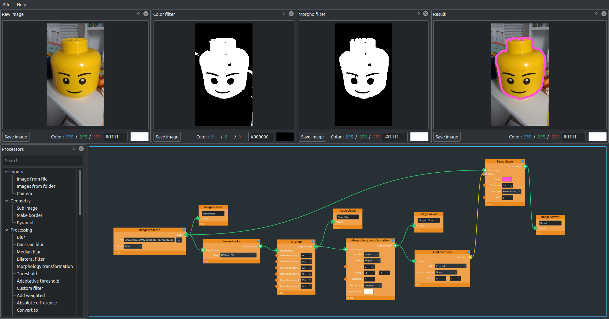
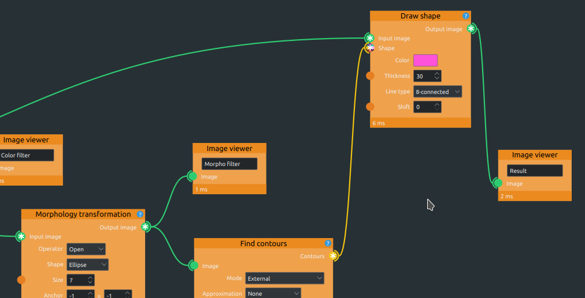
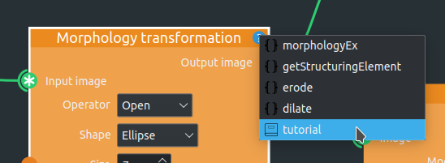
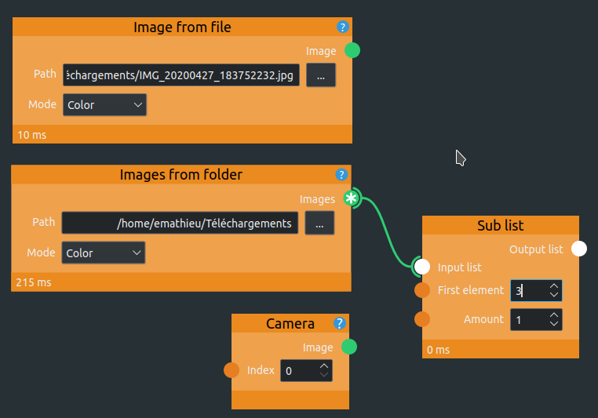

# What is CvComposer
CvComposer is a graphical interface to OpenCV functions. It allows you to combine many processing functions and see the effect in real-time. It may be used to :
  
 * Learn OpenCV by watching the effect of a single function
 * Design complex algorithms by combining functions
 * Fine-tune parameters (thresholds, kernel sizes, ...)
  
It uses a classic graph structure with drag and drop to let you create complex algorithms easily :

# How to use
## General use
The "Processors" list (on the left by default) contains all the functions currently implemented in CvComposer. Just drag and drop a processor to the work area to add it. Then connect different processors by their plug to fill the input of a function with the output of the previous one.

## Data types
Each processor plug can accept one or many data types, for example an image, a number, a rectangle, a contour, ... Each data type is represented by a color. Some input plugs accept only a single type, and some accept many. They may also contain a * to indicate that they can work with lists : for example, the "Find contours" functions outputs a list of contours, and the "Draw shape" functions inputs a list of many possible shapes :

## Help
Each processor has a help icon on the top-right : when you click on it, it gives you access to the online documentation of the function(s) used by the processor, and if available, the associates tutorial :

## Inputs
On the very left of your graph, you should have some data source to fill your algorithm with. It can be a single image, a folder containing multiple images, or a camera :

